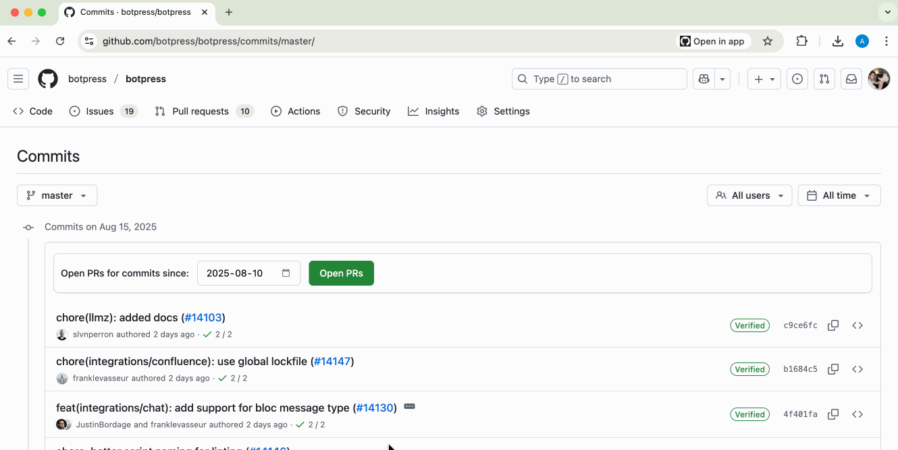

# GitHub PR Opener

A vibe-coded Chrome extension that opens all GitHub PRs associated with commits in a repo from a specific date. Created to help me save time when taking notes for the [Botpress changelog](https://botpress.com/docs/changelog).

This extension works best with squash merges. If the branch has a direct commit, the extension just opens that commit.

## Installation

1. Clone or download this repository
2. Open Chrome and navigate to `chrome://extensions/`
3. Enable **Developer mode** in the top right
4. Click **Load unpacked** and select the extension folder
5. The extension is now installed and ready to use!

## How to Use

1. **Navigate to a GitHub repository's commits page**
   - Go to any GitHub repository
   - Click on the commits count or navigate to `github.com/owner/repo/commits/branch`

2. **Use the date picker**
   - The extension will automatically add a date picker interface at the top of the commits list
   - Select the date from which you want to find PRs. The default is set to 7 days ago

1. **Open PRs**
   - Click the "Open PRs" button
   - The extension will search for PRs associated with each commit since your selected date
   - All found PRs will open in new background tabs

## Supported Pages

The extension works on GitHub commit list pages with URLs matching:
- `https://github.com/*/commits/*`

Examples:
- `https://github.com/microsoft/vscode/commits/main`
- `https://github.com/facebook/react/commits/main`
- `https://github.com/owner/repo/commits/feature-branch`

## Permissions

The extension requires these permissions:
- `activeTab`: To interact with the current GitHub page
- `tabs`: To open new tabs with PR links
- `https://github.com/*`: To access GitHub pages

## License

This project is open source and available under the MIT License.
